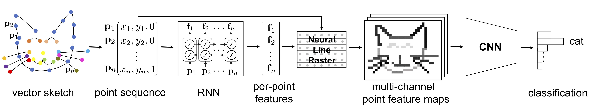

# Sketch-R2CNN: An RNN-Rasterization-CNN Architecture for Vector Sketch Recognition

By Lei Li, Changqing Zou, Youyi Zheng, Qingkun Su, Hongbo Fu, and Chiew-Lan Tai. (TVCG 2020)

Sketches in existing large-scale datasets like the recent QuickDraw collection are often stored in a vector format, with strokes consisting of sequentially sampled points. However, most existing sketch recognition methods rasterize vector sketches as binary images and then adopt image classification techniques. In this paper, we propose a novel end-to-end single-branch network architecture RNN-Rasterization-CNN (Sketch-R2CNN for short) to fully leverage the vector format of sketches for recognition. Sketch-R2CNN takes a vector sketch as input and uses an RNN for extracting per-point features in the vector space. We then develop a neural line rasterization module to convert the vector sketch and the per-point features to multi-channel point feature maps, which are subsequently fed to a CNN for extracting convolutional features in the pixel space. Our neural line rasterization module is designed in a differentiable way for end-to-end learning. We perform experiments on existing large-scale sketch recognition datasets and show that the RNN-Rasterization design brings consistent improvement over CNN baselines and that Sketch-R2CNN substantially outperforms the state-of-the-art methods.




## Link

[Paper](http://sweb.cityu.edu.hk/hongbofu/doc/Sketch_R2CNN_preprint.pdf)


## Citation

```
@article{Li_2020_TVCG,
	title = {{Sketch-R2CNN}: An RNN-Rasterization-CNN Architecture for Vector Sketch Recognition},
	author = {Li, Lei and Zou, Changqing and Zheng, Youyi and Su, Qingkun and Fu, Hongbo and Tai, Chiew-Lan},
    journal = {IEEE Transactions on Visualization and Computer Graphics},
	year = {2020},
    volume = {},
	pages = {1--1},
    doi = {10.1109/TVCG.2020.2987626},
}
```


## Instructions


### Dependencies

- CUDA
- [Docker](https://docs.docker.com/engine/install/ubuntu/): use ```docker/build.sh``` to build a [Docker image](https://hub.docker.com/r/craigleili/sketch-r2cnn/tags?page=1&name=latest) that includes a complete running environment.

(Or you may create a Python3 environment according to the instructions in ```docker/Dockerfile```.)


### QuickDraw Dataset

#### Training

Download the QuickDraw data from [here](https://github.com/tensorflow/magenta/tree/master/magenta/models/sketch_rnn#datasets). Use ```tools/quickdraw_to_hdf5.ipynb``` to preprocess the data and generate corresponding hdf5 files.

Go to folder ```scripts```. Fill the paths in ```quickdraw_r2cnn_train.sh``` and then run
```
sh quickdraw_r2cnn_train.sh
```

A copy of the trained weights can be downloaded from [here](https://1drv.ms/u/s!Alg6Vpe53dEDgZBY4YJnYw46OIxh3Q?e=vu3FLT) (file ```TrainedWeights.zip```).

#### Evaluation

The preprocessed data can be downloaded from [here](https://1drv.ms/u/s!Alg6Vpe53dEDgZBY4YJnYw46OIxh3Q?e=vu3FLT) (folder ```QuickDraw```). If you use these data in your work, please consider citing [[1]](#references).

Go to folder ```scripts```. Fill the paths in ```quickdraw_r2cnn_eval.sh``` and then run
```
sh quickdraw_r2cnn_eval.sh
```


### TUBerlin Dataset

Download the preprocessed data from [here](https://1drv.ms/u/s!Alg6Vpe53dEDgZBY4YJnYw46OIxh3Q?e=vu3FLT) (file ```TUBerlin.pkl```). If you use these data in your work, please consider citing [[2]](#references).

#### Training

Go to folder ```scripts```. Fill the paths in ```tuberlin_r2cnn_train.sh``` and then run
```
sh tuberlin_r2cnn_train.sh
```

A copy of the trained weights can be downloaded from [here](https://1drv.ms/u/s!Alg6Vpe53dEDgZBY4YJnYw46OIxh3Q?e=vu3FLT) (file ```TrainedWeights.zip```).

#### Evaluation

Go to folder ```scripts```. Fill the paths in ```tuberlin_r2cnn_eval.sh``` and then run
```
sh tuberlin_r2cnn_eval.sh
```


## References
1. Ha and Eck. [A Neural Representation of Sketch Drawings](https://github.com/tensorflow/magenta/tree/master/magenta/models/sketch_rnn). ICLR 2018.
1. Eitz et al. [How Do Humans Sketch Objects?](http://cybertron.cg.tu-berlin.de/eitz/projects/classifysketch/). TOG 2012.
1. Kato et al. [Neural 3D Mesh Renderer](https://github.com/hiroharu-kato/neural_renderer). CVPR 2018.
